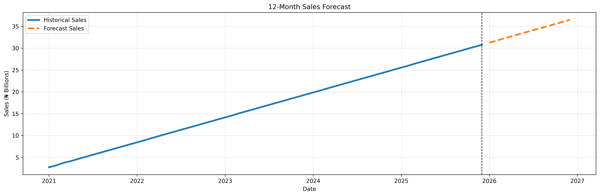

forecasting-sale




A comprehensive solution for forecasting future sales using historical data and Holt's models.

## Project Overview

This project provides a framework for analyzing historical sales data to predict future sales trends. The primary goal is to deliver accurate forecasts that can help in inventory management, resource allocation, and strategic business planning. By leveraging time-series analysis , this tool aims to provide actionable insights for decision-makers.

###  Key Features

*   **Data Processing**: Scripts for cleaning, transforming, and preparing raw sales data.
*   **Model Training**: Implementation of various forecasting models (e.g., ARIMA, Prophet, LSTM).
*   **Model Evaluation**: Metrics and visualizations to assess the performance of the trained models.
*   **Prediction**: A simple interface to generate future sales forecasts.
*   **Configurability**: Easy-to-manage configuration for datasets, models, and parameters.

---

## Installation & Setup

Follow these instructions to get a copy of the project up and running on your local machine.

### Prerequisites

Ensure you have the following installed on your system:

*   [Python](https://www.python.org/downloads/) (version 3.8+ recommended)
*   [pip](https://pip.pypa.io/en/stable/installation/) (Python package installer)
*   [Git](https://git-scm.com/downloads/) (for cloning the repository)

### Step-by-Step Installation

1.  **Clone the repository:**
    ```sh
    git clone https://github.com/your-username/forecasting-sale.git
    cd forecasting-sale
    ```

2.  **Create and activate a virtual environment** (recommended):
    *   On macOS and Linux:
        ```sh
        python3 -m venv venv
        source venv/bin/activate
        ```
    *   On Windows:
        ```sh
        python -m venv venv
        .\venv\Scripts\activate
        ```

3.  **Install dependencies:**
    The required Python packages are listed in `requirements.txt`.
    ```sh
    pip install -r requirements.txt
    ```


[](https://opensource.org/licenses/MIT)